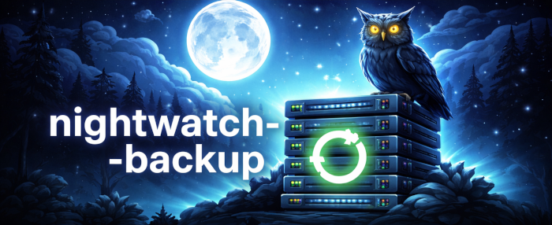

# Nightwatch Backup

I needed a reliable, set-it-and-forget-it backup tool that runs overnight without babysitting. Existing solutions were either too complex or too fragile. So I built a bash script that does incremental rsync snapshots, verifies integrity with checksums, and cleans up old backups automatically.



## Requirements

- Bash 4.0+, rsync, sha256sum, tar
- Root / sudo access

## Install

```bash
git clone https://github.com/tdiprima/nightwatch-backup.git
cd nightwatch-backup
sudo ./install/install.sh
```

The installer sets up binaries, config, and asks whether you want a **systemd timer** or **cron** job.

## Configure

```bash
sudo nano /etc/nightwatch-backup/nightwatch-backup.conf
```

Minimum required settings:

```bash
BACKUP_NAME="my-backup"
BACKUP_ROOT="/srv/backups"
SNAPSHOT_DIR="/srv/backups/snapshots"
SOURCES=("/etc" "/home" "/var/www")
```

## Run

```bash
sudo nightwatch-backup run   # manual backup
sudo ssctl run               # same, via control utility
sudo ssctl list              # list snapshots
sudo ssctl logs              # tail the log
sudo ssctl status            # check timer status
```

## Docs

See [`docs/`](docs/) for configuration, scheduling, restore, and troubleshooting guides.

<br>
